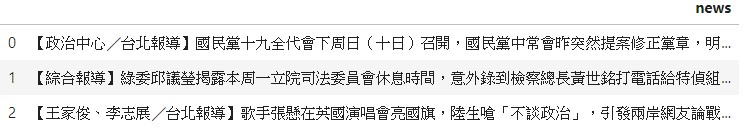
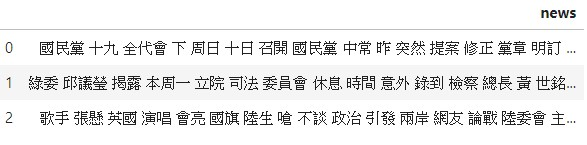
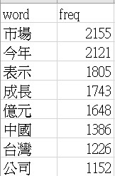
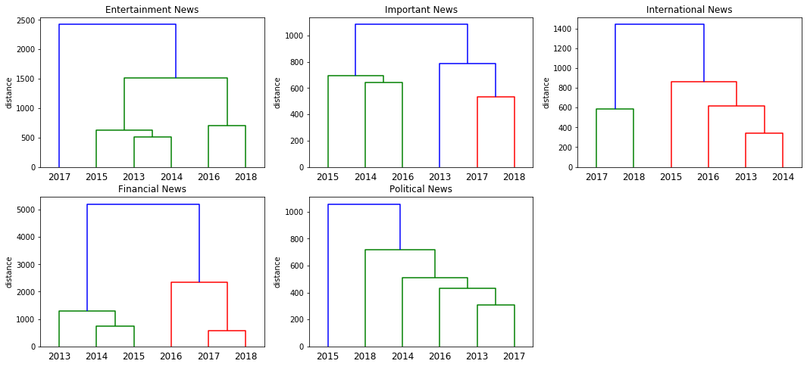

# Example: EDA of Chinese text in Dataframe with Python
In this file, I use python to do basic text mining on Chinese text. The text I use is Apple News sample from 2013 to 2018 in Taiwan, and I have scraped all news using Beautifulsoap.(You can see how I scrape in another file)
(Apple News Sample: 50 days news per year)
The data are all in pandas dataframe.
##### Here is the data(e.g. political news):

## Content
1. Chinese words Preprocessing (Jieba)
2. Chinese word and words Frequency (tfidf)
3. Shannon Entropy and Simpson Index of Chinese text
4. Hierarchy Clustering (tfidf + scipy.cluster.hierarchy)

## Details

### 1. Chinese words Preprocessing
In this part, I simply use Jieba to cut words, adding some words not in Jieba dictionary. In addition, I will remove url, english, numbers and stopwords here.
(I download stopwords.txt online)
##### After preprocessing, the data will be look like(e.g. political news):

### 2. Chinese word and words Frequency
In this part, I would make single word count and using CountVectorizer to count words frequency. Besides, I would convert all result into csv files.
##### Here are the text in each csv file(e.g. financial news):

### 3. Shannon Entropy and Simpson Index of Chinese text
In order to compare text's variety of news in different years, I compute Shannon Entropy of those texts. However, the number of words of different texts would affect the result of entropy. Hence, I also compute Simpson Index, which can remove the impact caused by the number of words. 
##### I combine Simpson Index of different types of news:

### 4. Hiearchy Clustering 
With words frequency, we can do hierarchy clustering. In this part, you can choose max_feature in CountVectorizer to determine the words you are going to use in clustering. 
##### Here I combine result from different types of news:

