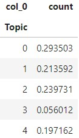
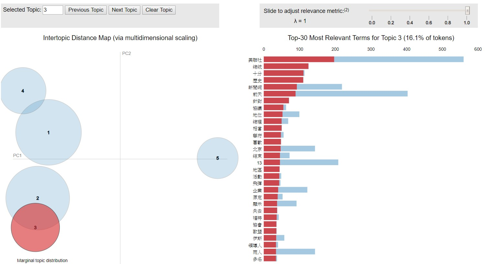

# Example: Chinese News text mining in Dataframe with Python(蘋果日報文本分析)
In this file, I use python to do basic text mining on Chinese text. The text I use is Apple News sample from 2013 to 2018 in Taiwan, and I have scraped all news using Beautifulsoap.The data are all saved as Pandas dataframe.
(Apple News Sample: 50 days news per year)
#### Genre of news
1. Important News
2. Entertainment News
3. International News
4. Financial News
5. Political News
##### 
這個分析我用網路爬蟲取得蘋果日報2013年至2018年中美年隨機選取50天的新聞(含有要聞版、娛樂版、國際板、財經版、政治板)，進行文本分析，了解蘋果日報的新聞用詞、內容概況。

##### Here is the data(e.g. political news):

## Content
0. Web Scraping
1. Chinese words Preprocessing (Jieba)（中文斷詞、去除停止詞）
2. Chinese word and words Frequency (tfidf)（使用tfidf計算詞頻）
3. Shannon Entropy and Simpson Index of Chinese text
4. Hierarchy Clustering (tfidf + scipy.cluster.hierarchy)
5. Topic Modelling using LDA(with visualization using LDAvis)

## Details

### 0. Web Scraping 網頁爬蟲
In this part, I will show you how I scrape Apple Daily News with Python.
Link of Apple Daily News: https://tw.appledaily.com/daily

### 1. Chinese words Preprocessing 中文斷詞、去除停用詞
In this part, I simply use Jieba to cut words, adding some words not in Jieba dictionary. In addition, I will remove url, english, numbers and stopwords here.
(I download stopwords.txt online)
##### After preprocessing, the data will be look like(e.g. political news):

### 2. Chinese Words Frequency 詞頻計算，並輸出為csv檔
In this part, I would make single word count and using CountVectorizer to count words frequency. Besides, I would convert all result into csv files.
##### Here are the text in each csv file(e.g. financial news):

### 3. Words Compleity: Shannon Entropy and Simpson Index of Chinese text 詞彙複雜度
In order to compare text's variety of news in different years, I compute Shannon Entropy of those texts. However, the number of words of different texts would affect the result of entropy. Hence, I also compute Simpson Index, which can remove the impact caused by the number of words. 
##### I combine Simpson Index of different types of news:

### 4. Hiearchy Clustering 文本分群
With words frequency, we can do hierarchy clustering. In this part, you can choose max_feature in CountVectorizer to determine the words you are going to use in clustering. 
##### Here I combine result from different types of news:

### 5. Topic Modelling using LDA(+LDAvis) 
After basic EDA, let's go on to topic modelling. I would count the proportion of each cluster. In addition, I will use LDAvis to see the result of LDA.
##### cluster proportion example:

##### LDAvis

